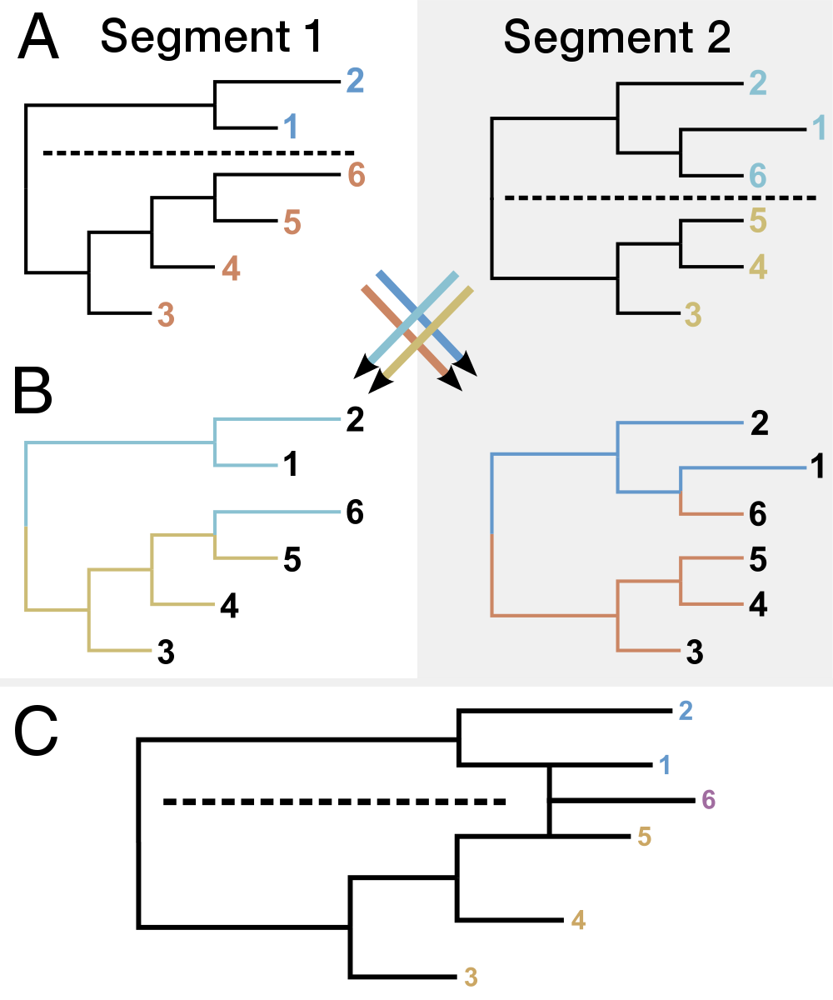
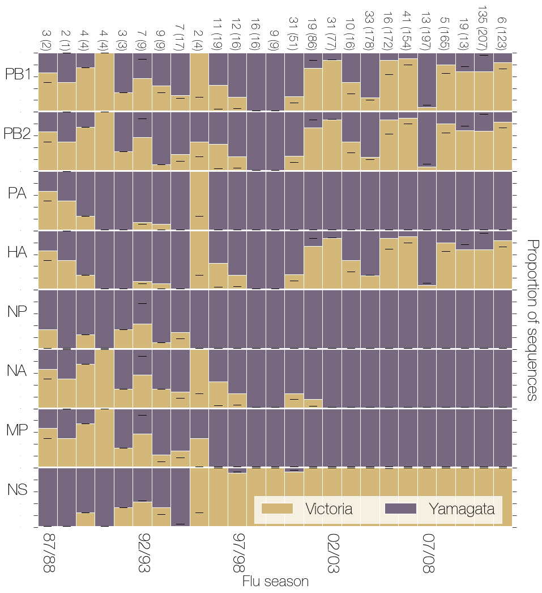
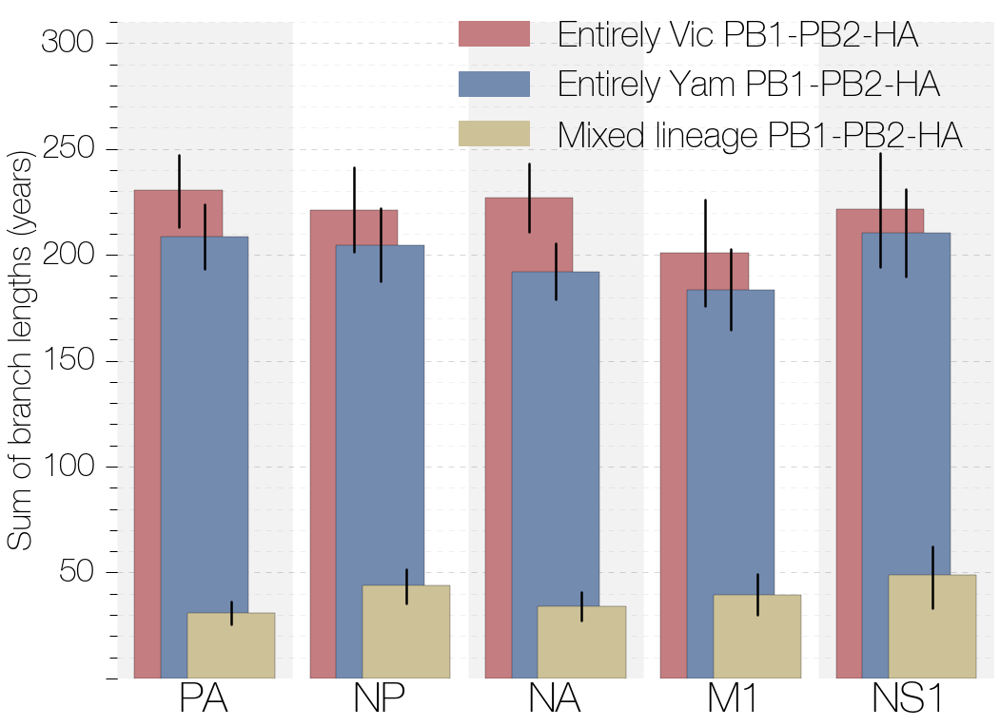

--------------------------------
### Figure 1.
Schematic analysis of reassortment patterns. (A) We begin by assigning sequences falling on either side of a specified bifurcation within each segment tree to different lineages, in this case, the Vic and Yam bifurcation that occurred in the early 1980s. (B) We then transfer lineage labels from one tree to the same tips in another tree. Transitions between labels along this second tree thus indicate reassortment events that combine lineages falling on different sides of the Vic/Yam bifurcation in the first tree. (C) A reassortment graph depiction shows that tip number 6 is determined to be a reassortant based on (B).

--------------------------------
### Figure 3.
Oldest TMRCA of all surviving branches over time. PA, NP, NA, MP, and NS segments of influenza B viruses show periodic increases in TMRCAs of all surviving branches (indicative of diversity loss), suggesting lineage turnover. PB1, PB2, and HA segments, on the other hand, maintain the diversity dating back to the initial split of Vic and Yam lineages. Each point is the mean TMRCA of all surviving lineages existing at each time slice through the tree and vertical lines indicating uncertainty are 95% highest posterior densities.

--------------------------------
### Figure 4.
Mean pairwise TMRCA between Vic and Yam branches under PB1, PB2, and HA label sets. PB1, PB2, and HA segment labels indicate that these segments show reciprocal preservation of diversity, which dates back to the split of Vic and Yam lineages. All other segments show increasingly more recent TMRCAs between branches labeled as Vic and Yam in PB1, PB2, and HA label sets. All vertical lines indicating uncertainty are 95% highest posterior densities.

--------------------------------
### Figure 5.
Ratio of Vic and Yam sequences in the data set. The ratio of Vic (yellow) to Yam (purple) sequences in each segment from the primary data set over time. Black lines indicate where this ratio lies in the larger secondary data set. Numbers at the top of the figure show the total number of genomes available for each influenza season in the primary data set comprised of 452 genomes from which the ratio was calculated, whereas the numbers in brackets correspond to numbers of sequences in the larger secondary genomes data set. Numbers at the bottom are influenza seasons from the 1987/1988 (87/88) season to the 2011/2012 season. Yam lineage of PA, NP, NA, and MP segments and Vic lineage of the NS segment eventually become fixed (in the population genetics sense of the word) in the influenza B population. PB1, PB2, and HA segments maintain separate Vic and Yam lineages.

--------------------------------
### Figure 7.
Amount of evolutionary time each segment has spent under different PB1–PB2–HA constellations. All segments have spent significantly more of their history with entirely Vic- or entirely Yam-derived PB1–PB2–HA complexes. All vertical lines indicating uncertainty are 95% highest posterior densities.

--------------------------------
### Figure 8.
ΔTMRCA statistics for different segment pairs. PB1, PB2, and HA trees exhibit reciprocally highly similar TMRCAs, unlike most other pairwise comparisons. All vertical lines indicating uncertainty are 95% highest posterior densities.
